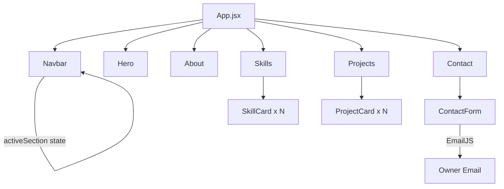

# Design Document: Personal Portfolio SPA

## Overview

A single-page application (SPA) personal portfolio built with React 19, Vite, and Tailwind CSS v4. The site presents the owner's professional identity across five content sections — Hero, About, Skills, Projects, and Contact — with a persistent navigation bar. Smooth scrolling, active-section highlighting, a responsive hamburger menu, and a contact form with validation round out the feature set.

The stack is already bootstrapped in the `moyo/` directory with `react-router-dom`, `framer-motion`, `react-scroll`, and Tailwind CSS v4 available as dependencies.

---

## Architecture

The application is a client-side SPA with no backend. Contact form submission will be handled via [EmailJS](https://www.emailjs.com/), a browser-side email service that requires no server.

```
moyo/
├── public/
│   └── resume.pdf          # Owner's downloadable resume
├── src/
│   ├── App.jsx             # Root component, section layout
│   ├── App.css             # Tailwind import
│   ├── index.css           # Global base styles
│   ├── main.jsx            # React entry point
│   ├── data/
│   │   ├── projects.js     # Project data array
│   │   └── skills.js       # Skills data array
│   ├── components/
│   │   ├── Navbar.jsx      # Persistent navigation bar
│   │   ├── HamburgerMenu.jsx
│   │   ├── Hero.jsx
│   │   ├── About.jsx
│   │   ├── Skills.jsx
│   │   ├── SkillCard.jsx
│   │   ├── Projects.jsx
│   │   ├── ProjectCard.jsx
│   │   ├── Contact.jsx
│   │   └── ContactForm.jsx
│   └── hooks/
│       ├── useActiveSection.js   # Intersection Observer for active nav link
│       └── useContactForm.js     # Form state and validation logic
```

### Data Flow



---

## Components and Interfaces

### Navbar

Renders a fixed top bar with section links. Uses `react-scroll`'s `Link` for smooth scrolling. Tracks the active section via `useActiveSection` hook and applies a highlight class to the matching link. Collapses to a hamburger icon below 768 px.

**Props:** none (reads `useActiveSection` internally)

### Hero

Full-viewport-height section. Displays owner name, title, tagline, profile image, and a CTA button that scrolls to Projects.

**Props:** none (data from constants or props passed from App)

### About

Displays professional summary, career highlights, and a resume download anchor (`<a href="/resume.pdf" download>`).

**Props:** none

### Skills

Renders skill categories. Each category has a title and a list of `SkillCard` components.

**Props:** none (reads from `src/data/skills.js`)

### SkillCard

Displays a single skill with its name and icon.

**Props:** `{ name: string, icon: ReactNode | string }`

### Projects

Renders a grid of `ProjectCard` components.

**Props:** none (reads from `src/data/projects.js`)

### ProjectCard

Displays project title, description, tech stack, thumbnail, and conditional links.

**Props:** `{ title, description, stack, thumbnail, liveUrl?, repoUrl }`

### Contact / ContactForm

Renders the contact form and social links. Delegates form logic to `useContactForm`.

**Props:** none

### useActiveSection (hook)

Uses `IntersectionObserver` to watch all section elements and returns the `id` of the section currently most visible in the viewport.

**Returns:** `string` — the active section id

### useContactForm (hook)

Manages form field state, validation, submission via EmailJS, and result state.

**Returns:** `{ fields, errors, status, handleChange, handleSubmit }`

---

## Data Models

### Project

```ts
interface Project {
  id: string;
  title: string;
  description: string;
  stack: string[];        // e.g. ["React", "Node.js"]
  thumbnail: string;      // image path or URL
  liveUrl?: string;       // optional — hidden when absent
  repoUrl: string;
}
```

### SkillCategory

```ts
interface SkillCategory {
  category: string;       // e.g. "Frontend"
  skills: Skill[];
}

interface Skill {
  name: string;
  icon: string;           // SVG path, emoji, or icon component name
}
```

### ContactFormFields

```ts
interface ContactFormFields {
  name: string;
  email: string;
  message: string;
}

interface ContactFormErrors {
  name?: string;
  email?: string;
  message?: string;
}

type FormStatus = 'idle' | 'submitting' | 'success' | 'error';
```

---

## Correctness Properties

*A property is a characteristic or behavior that should hold true across all valid executions of a system — essentially, a formal statement about what the system should do. Properties serve as the bridge between human-readable specifications and machine-verifiable correctness guarantees.*

### Property 1: Contact form rejects empty or whitespace-only required fields

*For any* combination of form field values where one or more of name, email, or message is empty or composed entirely of whitespace, the validation function SHALL return a non-empty errors object with an entry for each offending field.

**Validates: Requirements 6.3**

### Property 2: Contact form rejects malformed email addresses

*For any* string that does not conform to a valid email format (missing `@`, missing domain, leading/trailing spaces, etc.), the email validation function SHALL return an error for the email field.

**Validates: Requirements 6.4**

### Property 3: Contact form accepts fully valid submissions

*For any* form submission where name is a non-empty non-whitespace string, email is a properly formatted address, and message is non-empty, the validation function SHALL return an errors object with no entries.

**Validates: Requirements 6.2, 6.3, 6.4**

### Property 4: ProjectCard hides live link when liveUrl is absent

*For any* project data object where `liveUrl` is undefined or null, the rendered `ProjectCard` SHALL not contain a live-project anchor element.

**Validates: Requirements 5.6**

### Property 5: ProjectCard renders all required fields for any valid project

*For any* project data object with a non-empty title, description, non-empty stack array, and thumbnail, the rendered `ProjectCard` SHALL include the title text, description text, and every technology name from the stack array.

**Validates: Requirements 5.2**

### Property 6: Skills section renders all skills for any valid skills data

*For any* array of SkillCategory objects, the rendered Skills section SHALL display each category heading and every skill name within that category.

**Validates: Requirements 4.1, 4.2**

### Property 7: All images have non-empty alt text

*For any* component that renders an `` element using a data-driven source, the rendered image SHALL have a non-empty `alt` attribute.

**Validates: Requirements 8.2**

---

## Error Handling

| Scenario | Handling |
|---|---|
| EmailJS send failure | `useContactForm` sets `status = 'error'`; UI shows an error message to the visitor |
| Resume file missing | Browser default 404 behavior; mitigated by ensuring `public/resume.pdf` is present |
| Image load failure | `onError` handler on `` falls back to a placeholder |
| Invalid project data | TypeScript/PropTypes validation at dev time; graceful skip at runtime |

---

## Testing Strategy

### Unit / Example Tests (Vitest + React Testing Library)

- `useContactForm`: test validation logic with concrete valid and invalid inputs
- `ProjectCard`: test that live link is hidden when `liveUrl` is absent; test all required fields render
- `Navbar`: test that hamburger menu toggles visibility below 768 px breakpoint
- `useActiveSection`: test that the correct section id is returned when a section enters the viewport

### Property-Based Tests (fast-check + Vitest)

Property-based testing applies here for the contact form validation logic, `ProjectCard` rendering, `Skills` rendering, and image alt text — all pure functions with meaningful input variation.

Each property test runs a minimum of **100 iterations**.

Tag format: `Feature: personal-portfolio, Property {N}: {property_text}`

| Property | Test | Library |
|---|---|---|
| Property 1 | For any partial/empty form submission, validation returns errors for all empty/whitespace fields | fast-check |
| Property 2 | For any non-email string, email validator returns an error | fast-check |
| Property 3 | For any fully valid form input, validation returns no errors | fast-check |
| Property 4 | For any project without liveUrl, ProjectCard renders no live link | fast-check |
| Property 5 | For any valid project, ProjectCard renders title, description, and all stack items | fast-check |
| Property 6 | For any skills data array, Skills section renders all category headings and skill names | fast-check |
| Property 7 | For any data-driven image component, rendered img has non-empty alt text | fast-check |

### Integration / Smoke Tests

- Verify EmailJS is configured and a test message can be sent (manual smoke test)
- Verify resume download link resolves to a real file

### Accessibility

- Run `axe-core` or Lighthouse audit to check color contrast and keyboard navigation
- Manually verify all images have `alt` text
